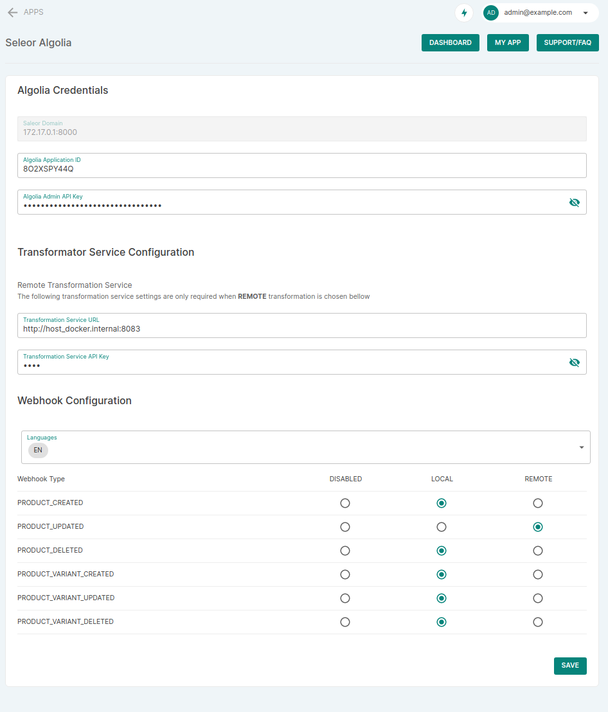

## Saleor-Algolia installation

1. Set the site domain to a docker address in: http://127.0.0.1:9000/site-settings. 

On MacOS this will be `host.docker.internal:8000` ([might require a Docker update](https://docs.docker.com/desktop/mac/networking/#i-want-to-connect-from-a-container-to-a-service-on-the-host) on older Docker For Mac versions `docker.for.mac.host.internal:8000` might work) on Linux `172.17.0.1:8000`

> The examples bellow will use `host.docker.internal`, replace it with `docker.for.mac.host.internal` or `172.17.0.1` according to the running system and Docker version.

1. Restart Saleor to refresh that value (it's cached)

```
docker-compose restart api
```

3. Create an entry for the local Saleor in Saleor-Algolia

```
docker-compose run --rm --no-deps saleor_algolia saleor-algolia add-domain host.docker.internal:8000
```

4. Install the Saleor-Algolia app by going to: http://127.0.0.1:9000/apps/install?manifestUrl=http://host.docker.internal:8082/configuration/manifest

5. Navigate to Saleor Algolia settings http://127.0.0.1:9000/apps/

6. Fill out the form to configure your instance

Algolia Application ID and Admin or Write API Key from https://www.algolia.com/account/api-keys/all

Transformation service URL: `http://host_docker.internal:8083`
Transformation service API Key: `test`

Language: `EN` 

Webhook types accordingly



## Index prefill

To prefill Algolia with the whole product database use the CLI tool:

```
docker-compose run --rm --no-deps saleor_algolia saleor-algolia index host.docker.internal:8000
```
